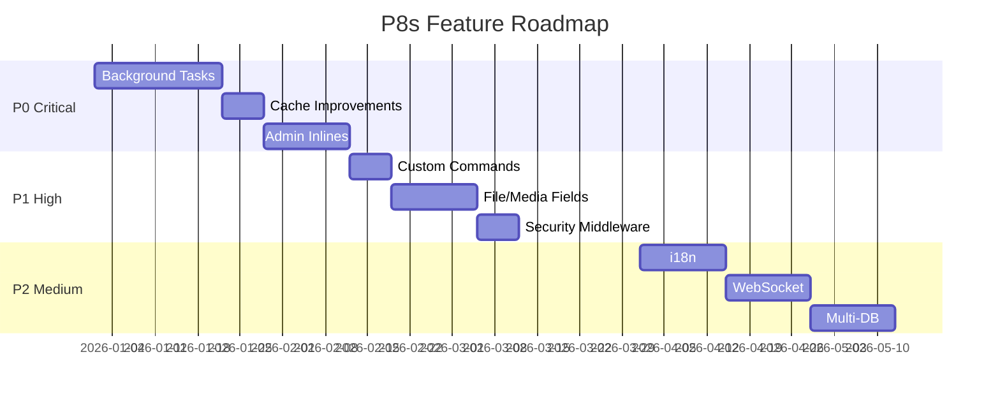

# P8s Feature Roadmap v2.0

> **Status**: Active Development\
> **Created**: 2026-01-12\
> **Goal**: Make P8s a compelling Django alternative

---

## Executive Summary

P8s già include molte feature Django-like (Signals, Cache, Forms, Admin, Auth). Questa roadmap definisce le **12 feature critiche** mancanti per raggiungere piena parità e competitività.

---

## Feature Status Overview

| #   | Feature             | Priority | Status      | Target  |
| --- | ------------------- | -------- | ----------- | ------- |
| 1   | Background Tasks    | 🔴 P0     | ✅ Complete  | Q1 2026 |
| 2   | Cache Improvements  | 🔴 P0     | ✅ Complete  | Q1 2026 |
| 3   | Admin Inlines       | 🔴 P0     | ✅ Complete  | Q1 2026 |
| 4   | Custom Commands     | 🟡 P1     | ✅ Complete  | Q1 2026 |
| 5   | File/Media Fields   | 🟡 P1     | ✅ Complete  | Q1 2026 |
| 6   | Security Middleware | 🟡 P1     | ✅ Complete  | Q2 2026 |
| 7   | i18n/l10n           | 🟢 P2     | Not Started | Q2 2026 |
| 8   | WebSocket Support   | 🟢 P2     | Not Started | Q2 2026 |
| 9   | Multi-Database      | 🟢 P2     | Not Started | Q3 2026 |
| 10  | Class-Based Views   | ⚪ P3     | Not Started | Q3 2026 |
| 11  | Template Engine     | ⚪ P3     | Not Started | Q3 2026 |
| 12  | Session Backend     | ⚪ P3     | Not Started | Q3 2026 |

---

## 🔴 P0: Critical Features

### 1. Background Tasks

**Goal**: Celery/ARQ integration per task asincroni

**Django Equivalent**: Celery + django-celery-beat

**Implementation**:
```python
# p8s/tasks/__init__.py
from p8s.tasks import task, shared_task, periodic_task

@task
async def send_email_async(user_id: int):
    user = await User.get(user_id)
    await send_email(user.email, "Welcome!")

@periodic_task(cron="0 9 * * *")  # Every day at 9am
async def daily_report():
    ...
```

**Files**:
- `src/p8s/tasks/__init__.py` [NEW]
- `src/p8s/tasks/backends.py` [NEW] - Celery, ARQ, InMemory
- `src/p8s/tasks/scheduler.py` [NEW]
- `src/p8s/cli/main.py` - Add `p8s worker`, `p8s beat`

**Dependencies**: `celery>=5.3.0`, `arq>=0.25.0` (optional)

---

### 2. Cache Improvements

**Goal**: Potenziare l'esistente `p8s.cache`

**Cosa Esiste**:
- ✅ MemoryCache, FileCache, RedisCache
- ✅ `cache_result`, `cache_page` decorators

**Cosa Manca**:
- [ ] Memcached backend
- [ ] Cache versioning
- [ ] Template fragment caching
- [ ] Low-level cache API (`cache.incr()`, `cache.decr()`)
- [ ] Cache key prefixing per multi-tenancy

**Files**:
- `src/p8s/cache/memcached.py` [NEW]
- `src/p8s/cache/backends.py` [MODIFY] - Add incr/decr

---

### 3. Admin Inlines

**Goal**: Edit related models nella stessa form

**Django Equivalent**: `TabularInline`, `StackedInline`

**Implementation**:
```python
from p8s.admin import register_model, TabularInline

class OrderItemInline(TabularInline):
    model = OrderItem
    extra = 1

@register_model
class Order(Model, table=True):
    ...

    class Admin:
        list_display = ["id", "customer", "total"]
        inlines = [OrderItemInline]
```

**Files**:
- `src/p8s/admin/inlines.py` [NEW]
- `src/p8s/admin/ui/src/components/admin/InlineEditor.tsx` [NEW]
- `src/p8s/admin/api.py` [MODIFY] - Inline CRUD endpoints

---

## 🟡 P1: High Priority

### 4. Custom Management Commands

**Goal**: Permettere comandi CLI custom per app

**Django Equivalent**: `myapp/management/commands/mycommand.py`

**Implementation**:
```python
# myapp/commands/import_data.py
from p8s.cli import Command

class ImportDataCommand(Command):
    name = "import_data"
    help = "Import products from CSV"

    def add_arguments(self, parser):
        parser.add_argument("--file", required=True)

    async def handle(self, file: str):
        # Import logic
        self.stdout.success(f"Imported from {file}")
```

```bash
p8s import_data --file=products.csv
```

**Files**:
- `src/p8s/cli/commands.py` [NEW] - Base Command class
- `src/p8s/cli/main.py` [MODIFY] - Auto-discover commands

---

### 5. File/Media Fields

**Goal**: ImageField, FileField con storage backends

**Cosa Esiste**: `src/p8s/storage/` (base implementation)

**Cosa Manca**:
- [ ] ImageField con resize automatico
- [ ] S3/GCS storage backends
- [ ] MIME type validation
- [ ] Upload progress

**Implementation**:
```python
from p8s.storage import ImageField, FileField, S3Storage

class Product(Model, table=True):
    image: str = ImageField(
        upload_to="products/",
        max_size=(800, 600),
        allowed_types=["image/jpeg", "image/png"]
    )
    document: str = FileField(
        upload_to="docs/",
        storage=S3Storage(bucket="my-bucket")
    )
```

**Files**:
- `src/p8s/storage/fields.py` [MODIFY]
- `src/p8s/storage/s3.py` [NEW]
- `src/p8s/storage/gcs.py` [NEW]

---

### 6. Security Middleware

**Goal**: Rate limiting, security headers

**Cosa Esiste**: CSRF middleware

**Cosa Manca**:
- [ ] Rate limiting (per-user, per-IP)
- [ ] Content Security Policy (CSP)
- [ ] HSTS headers
- [ ] X-Frame-Options
- [ ] Brute-force protection

**Implementation**:
```python
from p8s.middleware import RateLimitMiddleware, SecurityHeadersMiddleware

app = P8s(
    middleware=[
        RateLimitMiddleware(rate="100/minute"),
        SecurityHeadersMiddleware(csp_policy="default-src 'self'"),
    ]
)
```

**Files**:
- `src/p8s/middleware/ratelimit.py` [NEW]
- `src/p8s/middleware/security.py` [NEW]

---

## 🟢 P2: Medium Priority

### 7. Internationalization (i18n)

**Goal**: Multi-language support

**Implementation**:
```python
from p8s.i18n import gettext as _, activate

activate("it")
message = _("Welcome to our store")  # "Benvenuto nel nostro negozio"
```

**Files**:
- `src/p8s/i18n/__init__.py` [NEW]
- `src/p8s/i18n/middleware.py` [NEW]
- `src/p8s/cli/main.py` - Add `p8s makemessages`, `p8s compilemessages`

---

### 8. WebSocket Support

**Goal**: Real-time communication

**Implementation**:
```python
from p8s.websocket import WebSocketEndpoint

class ChatSocket(WebSocketEndpoint):
    async def on_connect(self, websocket):
        await websocket.accept()

    async def on_receive(self, websocket, data):
        await websocket.send_json({"echo": data})

app.add_websocket_route("/ws/chat", ChatSocket)
```

**Files**:
- `src/p8s/websocket/__init__.py` [NEW]
- `src/p8s/websocket/routing.py` [NEW]

---

### 9. Multi-Database Support

**Goal**: Read replicas, database routing

**Implementation**:
```python
class AppSettings(Settings):
    databases = {
        "default": "postgresql://...",
        "replica": "postgresql://replica.../",
    }

    database_routers = [ReadReplicaRouter]

class ReadReplicaRouter:
    def db_for_read(self, model):
        return "replica"

    def db_for_write(self, model):
        return "default"
```

**Files**:
- `src/p8s/db/routers.py` [NEW]
- `src/p8s/db/multi.py` [NEW]

---

## ⚪ P3: Nice to Have

### 10. Class-Based Views

Django-style generic views (CreateView, ListView, etc.)

### 11. Template Engine

Jinja2 integration for server-side rendering

### 12. Session Backend

Database/Redis session storage

---

## Implementation Order



---

## Getting Started

Per iniziare l'implementazione:

1. Scegli una feature dalla lista P0
2. Crea un branch: `git checkout -b feature/background-tasks`
3. Implementa con TDD
4. Documenta in `docs/`
5. PR con tests

---

## References

- [Django Documentation](https://docs.djangoproject.com/)
- [FastAPI Background Tasks](https://fastapi.tiangolo.com/tutorial/background-tasks/)
- [ARQ Documentation](https://arq-docs.helpmanual.io/)
- [Celery Documentation](https://docs.celeryq.dev/)
